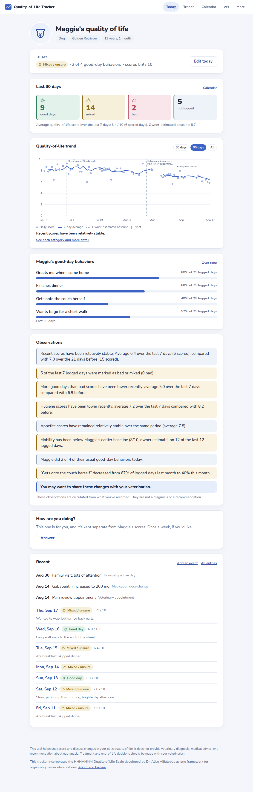
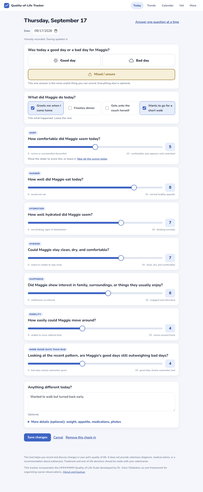
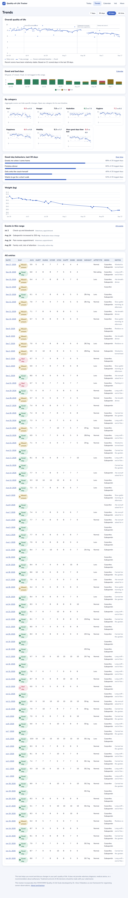
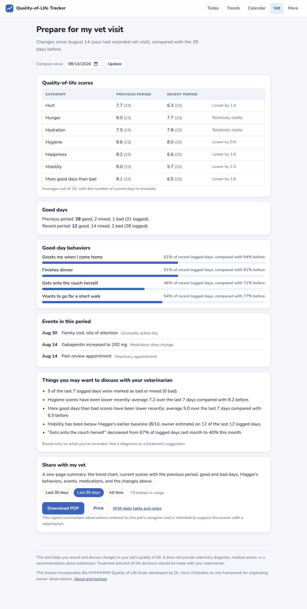

# Quality-of-Life Tracker

**See the pattern, not just the day.**

**[Try the demo](https://claude.ai/artifact/9UWy35g8BQPusiz9wxE1Zd)** · a read-only
snapshot with sample data for two dogs: Maggie (stable, then declining after a
treatment bump) and Bruno (a steady decline). Click through Today, Trends,
Calendar, and Vet; saving is switched off there. To track a real pet, run the
app on your computer (instructions below).

A gentle quality-of-life tracker for aging and seriously ill pets. Record
daily observations in seconds, see changes over time, and bring clearer
information to conversations with your veterinarian. Built in Python with
Flask and SQLite. Everything stays on your computer.



The app never gives a verdict. It shows the trend and the criteria; the owner
and the vet decide. It incorporates the HHHHHMM Quality of Life Scale
developed by Dr. Alice Villalobos as one framework for organizing owner
observations, and it is not a validated medical device.

## What it does

- **A check-in under thirty seconds.** First question: was today a good day or
  a bad day? Then a few yes/no behaviors specific to your pet, then optional
  0–10 scores for the seven HHHHHMM areas, one at a time, with a note. A
  **quick check-in** with only the first two steps takes under ten seconds.
- **What a good day looks like for *your* pet.** During setup you choose three
  to five concrete behaviors ("Greets me at the door", "Gets onto the couch
  herself"). They become the daily checkboxes and their own trend.
- **A baseline from before.** An optional estimate of what things were like
  about six months ago, stored separately and shown as a labelled reference
  line.
- **Honest trends.** Daily scores stay visible as dots. A 7-day windowed
  average is drawn only where there is enough data, lighter when data is
  limited. Missing days are never filled in. A single bad day is never a
  trend.
- **Observations, not verdicts.** Plain sentences with their numbers: "Mobility
  has been below Maggie's earlier baseline on 12 of the last 12 logged days."
  Every generated sentence passes a safety check.
- **Calendar** of good, mixed, and bad days with counts and last-month
  comparison. **Category views** and **behavior trends**. **Events** (vet
  visits, medication changes) marked on the charts.
- **Prepare for my vet visit**: what changed since your last visit, and a short
  list of things you may want to discuss.
- **A one-page PDF** for the appointment.
- **A weekly "How are you doing?"** for the caregiver, kept apart from the
  pet's data.
- **A gentle ending.** "My pet has passed away" keeps everything, stops
  prompts, and offers to keep, archive, export, or remove the profile.

| Check-in | Trends | Vet visit |
| --- | --- | --- |
|  |  |  |

## Run it

You need Python 3.11 or newer.

```bash
python3 -m venv .venv
source .venv/bin/activate        # Windows: .venv\Scripts\activate
pip install -r requirements.txt
python scripts/seed_demo.py --reset   # optional: two demo dogs, Maggie and Bruno
python run.py
```

Your browser opens at <http://127.0.0.1:5000>. Press Ctrl+C to stop. Data is
created under `data/` on first start; back it up from the More page.

| Variable | Effect |
| --- | --- |
| `PET_QOL_PORT` | Port (default 5000) |
| `PET_QOL_DATA_DIR` | Where to keep the data folder |
| `PET_QOL_NO_BROWSER=1` | Don't open a browser tab |
| `FLASK_DEBUG=1` | Auto-reload while developing |

Optional: `pip install pywebview` then `python desktop.py` for a desktop
window, or `pip install pyinstaller` then `pyinstaller pet_qol.spec` for a
standalone build in `dist/`.

## Tests

```bash
pytest
```

The suite covers the schema and migration, every page, the check-in flows, the
analytics (smoothing, sufficiency, classification), the insight engine, the
safety rules, the PDF's text, backup and restore, and the tone of the copy.

`python scripts/build_static_demo.py` rebuilds the read-only demo snapshot in
`dist/demo/` (a plain static site you can host anywhere).

There is also a browser walkthrough of every flow, from onboarding to the
passing flow, that runs against a throwaway data folder:

```bash
pip install playwright && playwright install chromium
python scripts/e2e_check.py
```

## Documentation

- [docs/ARCHITECTURE.md](docs/ARCHITECTURE.md): architecture, schema, the
  trend and smoothing algorithm, safety rules, limitations, next steps.
- [docs/DESIGN.md](docs/DESIGN.md): design decisions and what was hard.
- [PLAN.md](PLAN.md): the original semester plan.

## A note on what this app is not

It does not provide veterinary diagnosis, medical advice, or a recommendation
about euthanasia. Treatment and end-of-life decisions should be made with your
veterinarian. If you're concerned about a sudden or severe change in your
pet's condition, contact your veterinarian or an emergency veterinary clinic.
