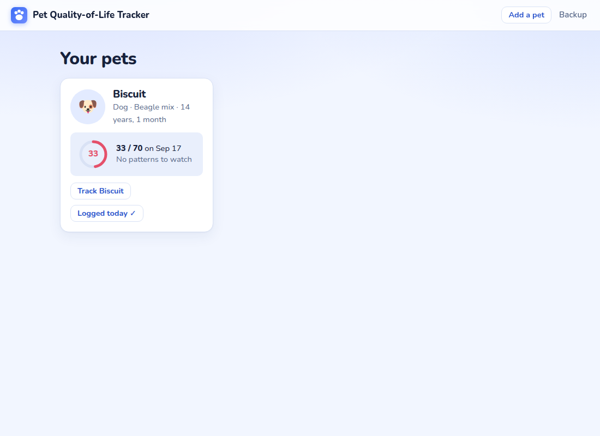
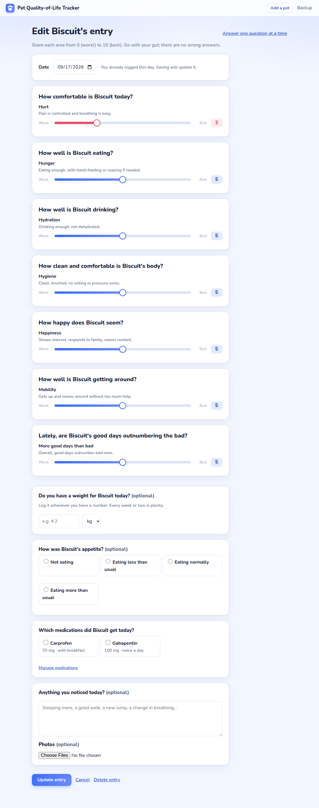
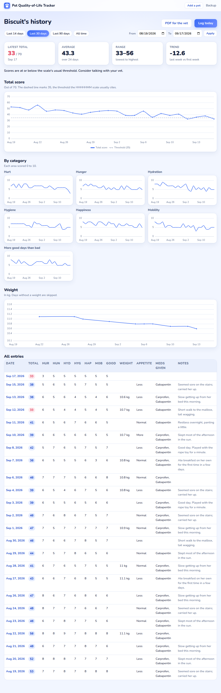

# Pet Quality-of-Life Tracker

A small offline app for pet owners to log a daily quality-of-life score for a
cat or dog near the end of its life, see trends over time, and bring a PDF
summary to the vet. Built in Python with Flask and SQLite. Everything stays on
your computer; no account, no internet needed.



## What it does

- **A daily check-in that asks one question at a time.** When today isn't
  logged yet, the app prompts you. The check-in walks through the seven HHHHHMM
  questions (Hurt, Hunger, Hydration, Hygiene, Happiness, Mobility, More good
  days than bad), each scored 0 to 10, then weight, appetite, medications given,
  notes, and photos, and ends with a review of the day. Prefer everything on one
  page? One click switches, and the app remembers.
- **See the pattern.** Total score over time with the scale's threshold, one
  small chart per category, and a weight chart, for the last 14, 30, or 90
  days, all time, or any custom range.
- **Notice things worth raising.** Gentle flags when the total sits at or below
  35 for three entries, a category stays at 3 or lower, weight drops 10% in a
  month, or appetite is logged as "not eating" two days running. Flags point at
  a pattern and suggest a conversation. They never make a decision.
- **Bring it to the vet.** A PDF with the charts, medications, patterns to
  discuss, the daily table, and your notes.
- **Track several pets.** Archive a pet when the time comes; their records are
  kept.
- **Back up in one click.** Download a zip of everything, and restore from it.

| Daily log | History and charts |
| --- | --- |
|  |  |

## Setup

You need Python 3.11 or newer.

```bash
python3 -m venv .venv
source .venv/bin/activate        # Windows: .venv\Scripts\activate
pip install -r requirements.txt
```

## Run

```bash
python run.py
```

Your browser opens at <http://127.0.0.1:5000>. Press Ctrl+C in the terminal to
stop. The database, photos, and a session key are created automatically under
`data/` on first start. That folder is your data; back it up from the Backup
page and never commit it.

Environment variables you can set:

| Variable | Effect |
| --- | --- |
| `PET_QOL_PORT` | Port to listen on (default 5000) |
| `PET_QOL_DATA_DIR` | Where to keep the data folder |
| `PET_QOL_NO_BROWSER=1` | Do not open a browser tab on start |
| `FLASK_DEBUG=1` | Auto-reload and tracebacks while developing |

### Try it with sample data

```bash
python scripts/seed_demo.py --reset
python run.py
```

This adds a dog named Biscuit with 45 days of made-up entries so the charts,
flags, and PDF have something to show.

### Optional: run it as a desktop window

```bash
pip install pywebview
python desktop.py
```

Same app, in its own window instead of a browser tab. Without pywebview
installed, `desktop.py` falls back to opening your browser.

### Optional: build a double-click executable

```bash
pip install pyinstaller
pyinstaller pet_qol.spec
```

The result is in `dist/PetQoLTracker/`. Run the `PetQoLTracker` executable
inside it; data is kept in a `data/` folder next to it. Build on the same kind
of computer you want to run it on (a Windows build for Windows, and so on).

## Test

```bash
pytest
```

The suite covers the database constraints, every page, the scoring and flag
rules, chart data, backup and restore, and the generated PDF's text.

## Project layout

```
run.py              start the app in a browser
desktop.py          start the app in a desktop window (optional pywebview)
pet_qol.spec        PyInstaller recipe (optional)
app/
  __init__.py       app factory, dashboard, secret key
  db.py             SQLite connection and schema setup
  schema.sql        tables: animals, entries, medications, entry_medications, photos
  models.py         animal data access
  entries.py        entry, medication, and photo data access
  scoring.py        the HHHHHMM scale definition and helpers
  flags.py          pattern rules (pure functions)
  charts.py         series and summaries for the charts and PDF
  pdf.py            the vet summary PDF (ReportLab)
  pdf_charts.py     chart images for the PDF (matplotlib)
  photos.py         image validation and resizing
  backup.py         zip backup and restore
  routes/           one file per area: animals, entries, history, export, settings
  templates/        Jinja pages
  static/           stylesheet, chart script, favicon, vendored Chart.js
scripts/
  seed_demo.py      sample data for demos
  screenshot.py     regenerates docs/screenshots (needs Playwright)
tests/              pytest suite
docs/               design write-up and screenshots
```

See [PLAN.md](PLAN.md) for the original plan and [docs/DESIGN.md](docs/DESIGN.md)
for the design decisions and what I'd do next.

## A note on what this app is not

It is not a medical device and it does not tell anyone when to make an end-of-
life decision. It records an owner's daily impressions using a published scale
and shows them clearly, so that the conversation with the vet starts from
shared information instead of memory.

## Status

- [x] Milestone 1: project skeleton, database schema, tests
- [x] Milestone 2: animals (add, edit, archive, photo, pick current pet)
- [x] Milestone 3: daily entry (scores, weight, appetite, notes, medications, photos)
- [x] Milestone 4: history and charts
- [x] Milestone 5: flags (patterns to watch)
- [x] Milestone 6: PDF export for the vet
- [x] Milestone 7: polish, backup and restore, packaging, docs
